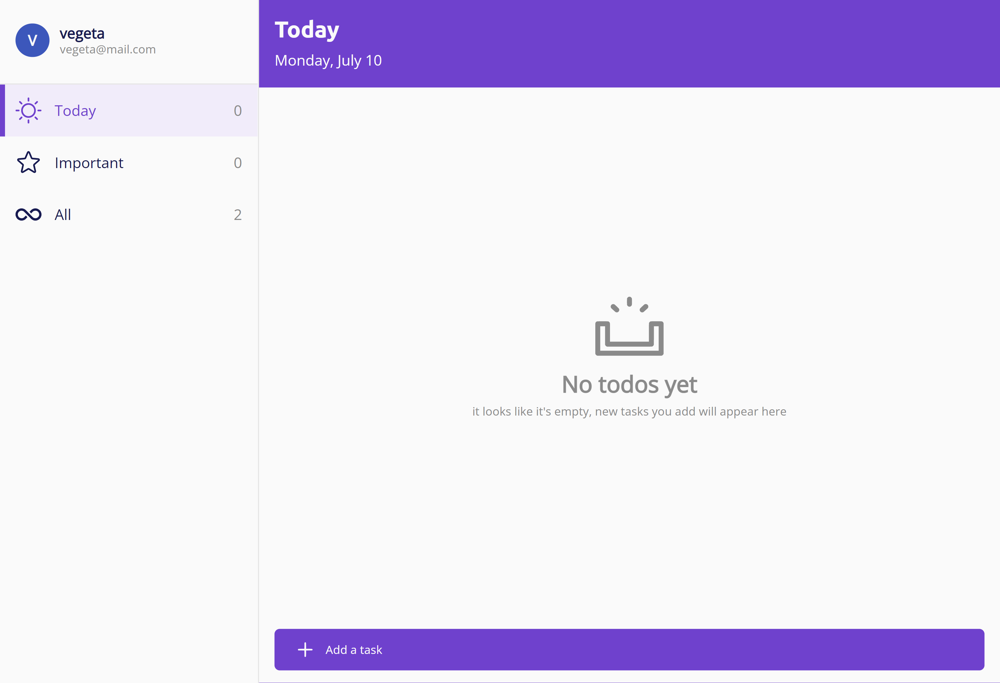

# ToDo app

This is a simple web application that allows you to create and manage your to-dos. Live demo here https://iaosan.github.io/todo-app/#/auth.

## Technologies Used

-   Vite - version 4.3.2.
-   React - version 18.2.0.
-   Sass - version 1.62.1.
-   React-toastify - version 9.1.3

## Features

-   User registration and login.
-   Creation of tasks with descriptions.
-   Marking tasks as completed and important.
-   Editing and deleting tasks.

## Screenshots

## Setup

1. Clone this repository: `git clone https://github.com/IAOsan/todo-app/`
2. Install the dependencies: `npm install`
3. Start the application: `npm start`
4. Open your web browser and go to `http://localhost:3000`

## Usage

1. **Registration and Login**: To use all the functions of the application, please register with your account or log in if you already have one.

2. **Create Tasks**: Once you are logged in, you can create new tasks by clicking the "Add Task" button. Enter a description.

3. **Manage Tasks**: You can see your tasks in the main list. Mark tasks complete when you're done and, if necessary, edit or delete tasks.

4. **Log Out**: When you're done, be sure to log out to protect your privacy.

## Inspiration

This app is inspired by Microsoft To Do: List & tasks.
